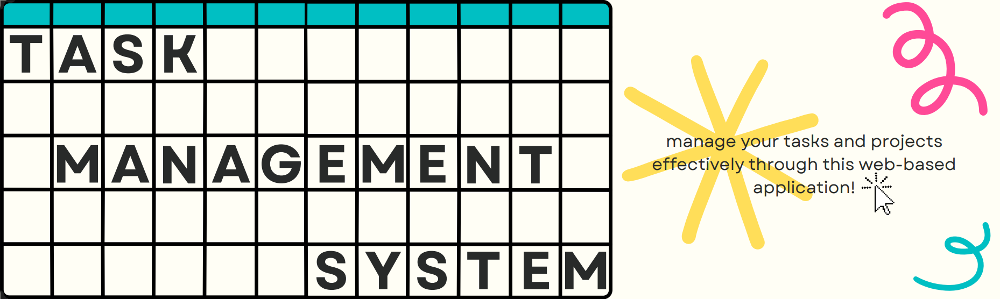

# ⭐ Task Management System
The task management application was developed to make it easier for users to execute projects. 
Using this app, you can create your own project, add tasks to the project, and set deadlines. 
You can also add comments and labels to them, as well as attachments that will be stored in the Dropbox.
In addition, if you decide to register, create a new project, add a comment or upload a file, you will receive an email notification!
---
## 🔌 Used technologies and tools:
- **Spring Boot** - A framework for building standalone, production-ready Spring applications. 
It simplifies configuration and reduces boilerplate by providing auto-configuration and embedded servers.

- **Spring Security** - A robust framework for securing Spring applications. 
It supports authentication, authorization, and security-related features like password encoding and CSRF protection.

- **Spring Data JPA** - A Spring module that simplifies database access with JPA (Java Persistence API). 
It provides repositories, query methods, and transaction management for working with relational data.

- **Spring Boot Starter Mail** - A Spring Boot starter dependency for integrating JavaMail.
It simplifies sending emails using templates and SMTP configurations in Spring applications.

- **Swagger** - A tool for documenting and testing RESTful APIs. 
It generates interactive API documentation and supports API exploration through a user-friendly UI.

- **Docker** - A platform for containerizing applications. 
It enables consistent deployment across environments by packaging code, dependencies, and runtime into isolated containers.

- **Liquibase** - A database schema change management tool. 
It tracks, manages, and applies incremental database changes through versioned scripts, supporting rollback and migrations.

- **MySQL** - A popular open-source relational database management system used 
for storing and retrieving structured data efficiently.

- **Dropbox API** - An API for integrating with Dropbox. 
It allows applications to access, upload, manage, and share files and folders in a user's Dropbox account.
---

## 📌 Faced challenges
### Dropbox integration
> This is my first integration with Dropbox. 
> That's why at first it was quite difficult to understand how uploading, downloading, 
> and deleting files from the Dropbox should work, rather than from a database that only stores file IDs. Fortunately, 
> Dropbox provides [documentation](https://www.dropbox.com/developers/documentation/http/documentation#files-upload)
> that was very useful for me and for developers in general.

### Email notifications
> Developing a notification system was also an interesting experience for me. 
> Since it is necessary to use email for user registration, 
> I decided that the best option would be to send notifications using it. 
> To do this, I created an Email Service and used JavaMailSender. 
> This process was pretty quick, but to send notifications you need to use a real mail 
> that you will allocate specifically for this work. 
> It's also important to note that you don't use a real password, 
> but a specially generated key that allows your application to access this email.

## 📍 Controllers overview

### Authentication controller
| HTTP Request                             | Endpoint                 | Description            |
|------------------------------------------|--------------------------|------------------------|
| POST | `/api/auth/registration` | Register a new user    |
| POST | `/api/auth/login`        | Login an existing user |
---
### User controller
| HTTP Request                             | Endpoint               | Description                         |
|------------------------------------------|------------------------|-------------------------------------|
| GET   | `/api/users/me`        | Get all information about user      |
| PUT    | `/api/users/me`        | Update information about user       |
| PUT    | `/api/users/{id}/role` | Update user role (Only for admins)  |
---
### Project controller
| HTTP Request                             | Endpoint             | Description                       |
|------------------------------------------|----------------------|-----------------------------------|
| POST | `/api/projects`      | Create a new project              |
| GET   | `/api/projects`      | Get all user projects             |
| GET   | `/api/projects/{id}` | Get details of user project by ID |
| PUT    | `/api/projects/{id}` | Update project by its ID          |
| DELETE  | `/api/projects/{id}` | Delete project by its ID          |
---
### Task controller
| HTTP Request                             | Endpoint          | Description                |
|------------------------------------------|-------------------|----------------------------|
| POST | `/api/tasks`      | Create a new task          |
| GET   | `/api/tasks`      | Get all user tasks         |
| GET   | `/api/tasks/{id}` | Get task details by its ID |
| PUT    | `/api/tasks/{id}` | Update task by its ID      |
| DELETE  | `/api/tasks/{id}` | Delete task by its ID      |
---
### Label controller
| HTTP Request                             | Endpoint           | Description                |
|------------------------------------------|--------------------|----------------------------|
| POST | `/api/labels`      | Create a new label         |
| GET   | `/api/labels`      | Get all labels from DB     |
| PUT    | `/api/labels/{id}` | Update an existing label   |
| DELETE  | `/api/labels/{id}` | Delete label by ID from DB |
---
### Comment controller
| HTTP Request                             | Endpoint             | Description                         |
|------------------------------------------|----------------------|-------------------------------------|
| POST | `/api/comments`      | Add new comment to existing task    |
| GET   | `/api/comments/{id}` | Get all comments related to task ID |
---
### Attachment controller
| HTTP Request                             | Endpoint                    | Description                                 |
|------------------------------------------|-----------------------------|---------------------------------------------|
| POST | `/api/attachments`          | Upload attachment to task                   |
| GET   | `/api/attachments/{taskId}` | Get all attachments by task ID from DB      |
| GET   | `/api/attachments`          | Get file by its Dropbox ID from Dropbox     |
| DELETE  | `/api/attachments/{id}`     | Delete attachment by ID from Dropbox and DB |
---

##  ❔ How to set up Task Management app using Docker:
1. Install [Docker](https://www.docker.com/products/docker-desktop/).
2. Clone [THIS](https://github.com/margosalii/task-management-app) repository.
3. Configure `.env` file with all the necessary environment variables.
4. Build the project by command `mvn clean install`.
5. Run the command `docker-compose up --build` to build and launch containers.

*WARN! Sometimes it takes more time for MySqlDB to load. Wait for some seconds*.

---
## 🔗 What about testing Task Management API?
As soon as the application is launched, you can start testing its functionality.
- You can use Swagger UI, which provides a clear interface and allows you to test the API directly from the browser, 
giving you the ability to send requests and view responses. Access at http://localhost:8088/swagger-ui/index.html
- If you don't open Docker and just run application with IDE - access it at http://localhost:8080
- I also created a Postman collection. There you can test the functionality of all the controllers of this application. 
Let's test [Task Management in Postman](https://www.postman.com/aviation-participant-90467650/task-management-system) right now!
---
